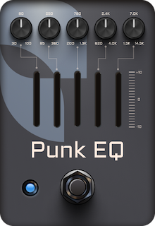

# PunkEQ - An equalizer pedal plugin

## Introduction
This is a simple vst3/au equalizer plugin made with [JUCE](https://juce.com/) that I built to introduce myself in the JUCE framework. It's a simple equalizer, it has nothing special, but I need an equalizer pedal for a future project so here it is.
